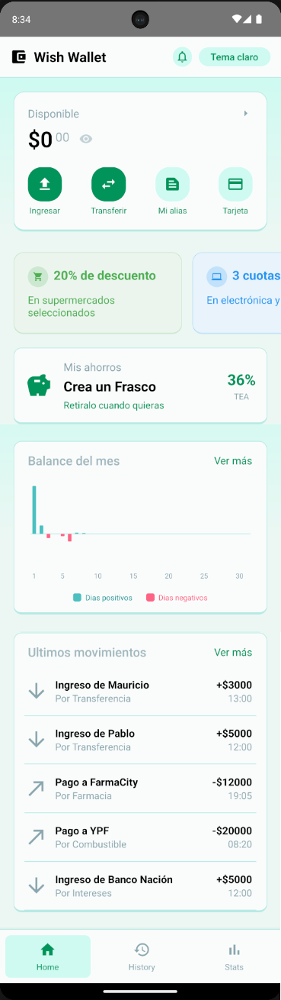
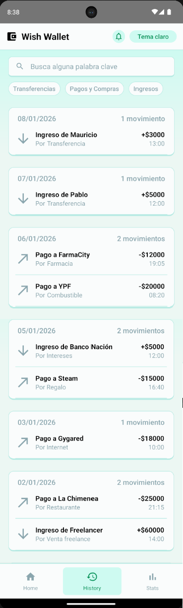
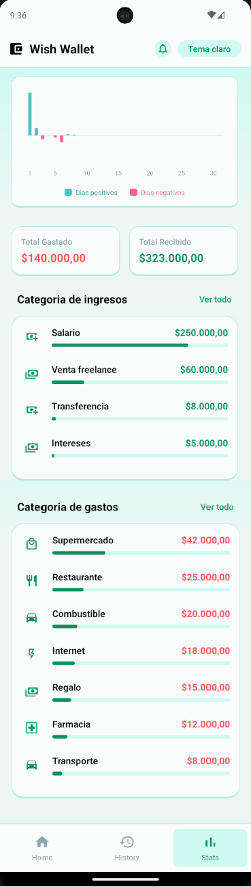
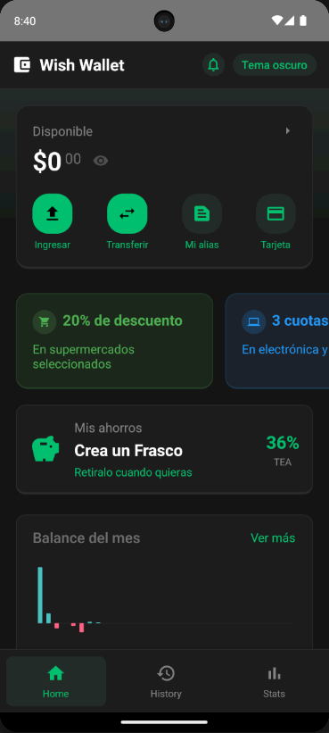
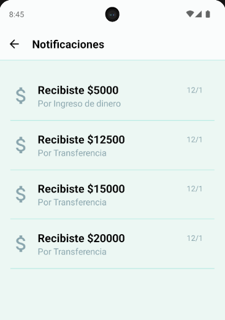
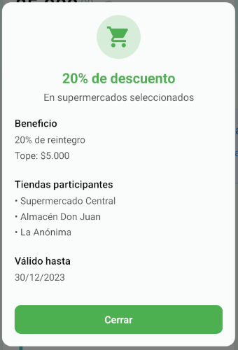
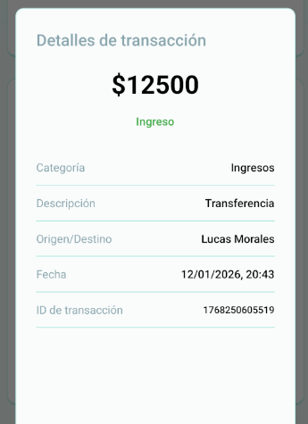
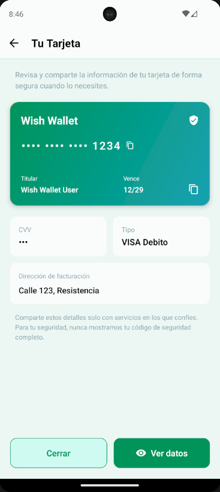

# WishWallet 📱

WishWallet es una aplicación movíl de gestión financiera personal construida con **React Native**. Tiene un gran enfoque al diseño UI y UX para el seguimiento de gastos, ingresos y ahorros, incluyendo simulaciones en tiempo real de movimientos para una experiencia más dinámica.

## 🔍 Vista Previa

|           Home           |           Historial            |        Estadísticas        |            Modo Oscuro             |
| :----------------------: | :----------------------------: | :------------------------: | :--------------------------------: |
|  |  |  |  |
|   **Página de Inicio**   |    **Lista de Movimientos**    |   **Análisis de Gastos**   |    **Soporte para Modo Oscuro**    |

### ✨ Características Destacadas

|                Notificaciones                |             Beneficios             | Detalles                         |            Tarjetas            |
| :------------------------------------------: | :--------------------------------: | :------------------------------- | :----------------------------: |
|  |  |  |  |
|          **Avisos en tiempo real**           |      **Modales de Beneficio**      |    **Detalles de Movimiento**    |      **Vista de Tarjeta**      |

## ✨ Características Principales

- **Dashboard Inteligente**: Visualización clara del saldo actual, tarjetas y últimos movimientos.
- **Estadísticas Detalladas**:
  - Desglose mensual de ingresos y gastos.
  - Clasificación por categorías con barras de progreso dinámicas.
  - Iconos inteligentes según el tipo de gasto (comida, transporte, servicios, etc.).
- **Simulación en Tiempo Real**:
  - Generación automática de gastos (suscripciones, servicios) y transferencias recibidas.
  - Notificaciones locales instantáneas mediante **Notifee**.
- **Historial Avanzado**:
  - Búsqueda por palabras clave.
  - Filtros rápidos por tipo (Transferencias, Pagos, Ingresos).
  - Agrupación por fechas.
- **Gestión de Datos**: Persistencia local mediante **AsyncStorage**.
- **Personalización**:
  - Soporte completo para Modo Claro y Modo Oscuro.
  - Generación de reportes en PDF y soporte para impresión.
- **Diseño Premium**: Interfaz moderna con gradientes, micro-animaciones y una paleta de colores curada para una mejor experiencia visual.

## ⚡ Funcionalidades para el Usuario

- **Privacidad de Saldo**: En el dashboard principal, puedes ocultar tu saldo total con un solo toque para mayor privacidad en lugares públicos.
- **Seguridad de Tarjeta**: Visualiza los datos de tu tarjeta virtual de forma segura; los números sensibles pueden ocultarse y mostrarse a demanda.
- **Historial Inteligente**:
  - **Búsqueda**: Encuentra cualquier movimiento por nombre, categoría o monto.
  - **Filtros**: Clasifica rápidamente entre transferencias, ingresos o compras.
- **Análisis de Finanzas**: Pantalla de estadísticas dedicada con gráficos de barras de progreso para entender en qué gastas y de dónde provienen tus ingresos.
- **El Frasco de Ahorro (Crecimiento)**: Una sección especial donde puedes ver cómo tus ahorros generan intereses simulados, incentivando el hábito del ahorro.
- **Agenda de Contactos**: La app guarda automáticamente tus contactos frecuentes de transferencias para que enviar dinero sea más rápido. Además, cuenta con una lista de contactos predefinidos para agilizar tus primeras pruebas.
- **Promociones y Ofertas**: Sección exclusiva con descuentos y beneficios en tiendas populares (comida, tecnología, supermercados), con detalles de topes de reintegro y fechas de vigencia.
- **Modo Oscuro/Claro**: Cambia el tema de la aplicación instantáneamente desde el header para adaptarlo a tu preferencia.

## ⚙️ Notas para Desarrolladores

- **Motor de Simulación Activa**:
  - La app genera **Pagos Automáticos** de servicios (Netflix, Spotify, etc.) cada 31 segundos si hay saldo suficiente.
  - Genera **Transferencias Recibidas** de personas ficticias cada 43 segundos para mantener el flujo de caja dinámico.
  - Notificaciones locales integradas vía **Notifee** para cada evento simulado.
- **Reset de Datos (Developer Shortcut)**: Al presionar el título **"Wish Wallet"** en el encabezado de la app, se ejecutará una limpieza completa del `AsyncStorage` (vía `limpiarStorage()`), devolviendo la aplicación a su estado inicial cargando los gastos por defecto instalados.
- **Persistencia Local**: Toda la lógica de balance, historial filtrado por fecha, contactos recientes y ahorros se gestiona localmente, permitiendo un testeo offline fluido.

## 🚀 Tecnologías Utilizadas

- **Core**: React Native (v0.82.1), React 19.
- **Navegación**: React Navigation.
- **Estado**: Context API.
- **Estilos**: Vanilla StyleSheet con soporte dinámico de temas.
- **Gráficos**: React Native Chart Kit.
- **Persistencia**: @react-native-async-storage/async-storage.
- **Notificaciones**: @notifee/react-native.
- **UI Components**:
  - React Native Linear Gradient.
  - React Native Vector Icons (MaterialIcons & MaterialCommunityIcons).
- **Utilidades**:
  - React Native HTML to PDF.
  - React Native Print.

## 🛠️ Instalación y Configuración

Sigue estos pasos para ejecutar el proyecto localmente:

1. **Clonar el repositorio**:

   ```bash
   git clone https://github.com/usuario/WishWallet.git
   cd WishWallet
   ```

2. **Instalar dependencias**:

   ```bash
   npm install
   # o
   yarn install
   ```

3. **Ejecutar en Android**:

   ```bash
   npx react-native run-android
   ```

4. **Ejecutar en iOS** (Requiere macOS):
   ```bash
   cd ios && pod install && cd ..
   npx react-native run-ios
   ```

## 📁 Estructura del Proyecto

- `/components`: Componentes reutilizables (Tarjetas, Modales, Alertas).
- `/contexts`: Manejo de estado global mediante `AppContext`.
- `/pages`: Pantallas principales (Home, History, Statistics).
- `/public`: Activos estáticos e imágenes.
- `colors.js`: Definición del sistema de diseño y temas (Light/Dark).
